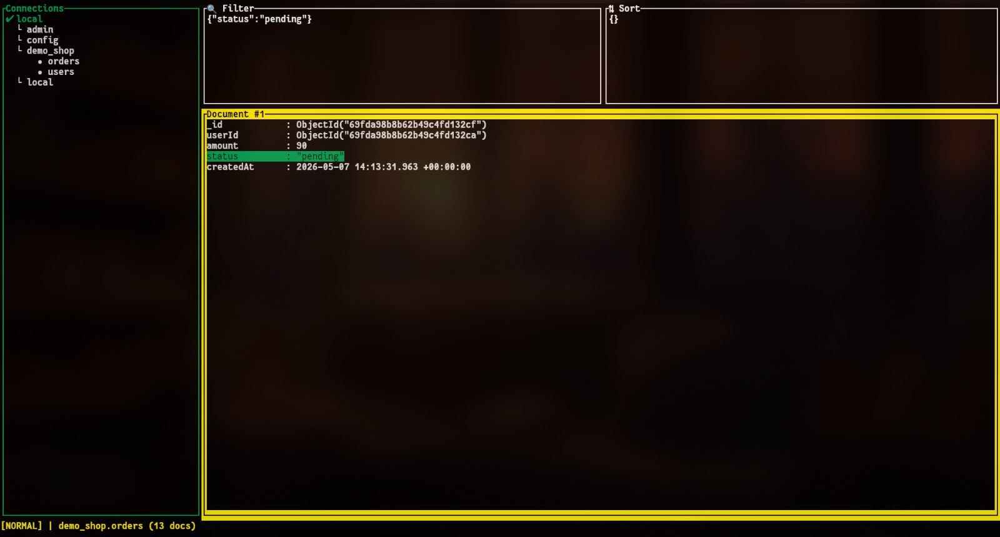

# MongoDB TUI 

A terminal-based TUI application for browsing and managing your MongoDB collections and databases. It supports JSON import/export, document editing, collection management, and script execution.



## Prerequisities

Before installaion make sure following tools are installed : 

### MongoDB

#### Arch Linux (or Arch-based distros)
```sh
yay mongodb-bin
yay mongodb-tools-bin #for import export
```
```sh
sudo systemctl start mongodb
```
```sh
sudo systemctl enable mongodb
```
#### Other Distros
For installation instructions, see:
https://www.mongodb.com/docs/manual/installation/
#### Rust
```sh
curl --proto '=https' --tlsv1.2 -sSf https://sh.rustup.rs | sh
```
After installation, either restart your terminal or run:
```sh
source $HOME/.cargo/env
```
Then confirm installation with:
```sh
rustc --version
cargo --version
```

### Install
#### Arch Linux (or Arch-based distros)
```sh
yay mongodbtui
mongodbtui
```

#### Build from Source
```sh
git clone git@github.com:vehbican/mongodbtui.git
cd mongodbtui
chmod +x install.sh
./install.sh
mongodbtui
```
## Keybindings

### Global
| Key        | Action                                |
|------------|----------------------------------------|
| `?`        | Toggle help popup                      |
| `t`        | Cycle theme (system, emerald, ocean, rose, monochrome) |
| `y` / `n`  | Confirm / cancel a pending action      |
| `q`        | Quit the application                   |
| `Esc`      | Dismiss popup / clear search hits      |

### Focus Navigation
| Key            | Action                           |
|----------------|----------------------------------|
| `Ctrl+l`       | Focus → Documents                |
| `Ctrl+h`       | Focus → Connections              |

### List Navigation
| Key         | Action                                 |
|-------------|----------------------------------------|
| `j` / `↓`   | Move down                              |
| `k` / `↑`   | Move up                                |
| `Enter`     | Connect / expand database / load collection |

### Connections & Collections
| Key     | Action                                                                 |
|---------|------------------------------------------------------------------------|
| `o`     | Add new MongoDB connection                                             |
| `/`     | Search collections                                                     |
| `n` / `N` | Next / previous collection search match                              |
| `e`     | Edit selected connection or collection name                            |
| `x`     | Export selected collection or database                                 |
| `i`     | Import collection into selected database                               |
| `I`     | Import database into selected connection                               |
| `f`     | Run shell script from file picker                                      |
| `d` + `d` | Request deletion of selected collection or database                 |

### Documents
| Key       | Action                               |
|-----------|--------------------------------------|
| `/`       | Edit filter command                  |
| `s`       | Edit sort command                    |
| `Ctrl+d` / `PageDown` | Scroll document down        |
| `Ctrl+u` / `PageUp` | Scroll document up            |
| `Enter`   | Expand/collapse selected field       |
| `n` / `N` | Next / previous field in selected document |
| `e`       | Edit selected document in external editor |
| `U`       | Edit a bulk update for filtered documents in `$EDITOR` |
| `X`       | Request deletion of filtered documents |
| `y`       | Copy selected field as filter fragment |
| `d` + `d` | Request deletion of selected document  |
| `D`       | Request deletion of selected field (except `_id`) |

### Insert Mode
| Key         | Action               |
|-------------|----------------------|
| `Enter`     | Submit input / apply filter or sort |
| `Esc`       | Cancel editing       |
| `← / →`     | Move cursor          |
| `Backspace` | Delete character     |
| `Ctrl+V`    | Paste clipboard      |
| `Ctrl+Shift+V` | Paste from terminal |

### File Picker (Import / Export / Script)
| Key       | Action                          |
|-----------|---------------------------------|
| `j / k`   | Navigate entries                |
| `Space`   | Select/Deselect file            |
| `Enter`   | Enter directory                 |
| `c`       | Confirm action (import/run)     |
| `Esc`     | Exit file picker                |

## Config Paths

- The `connections.csv` file is used to store your saved MongoDB connections and is located at:  
  `~/.config/mongodbtui/connections.csv`

- All exported collections and databases (as .json files and folders) are saved under:  
  `~/.local/share/mongodbtui/`
