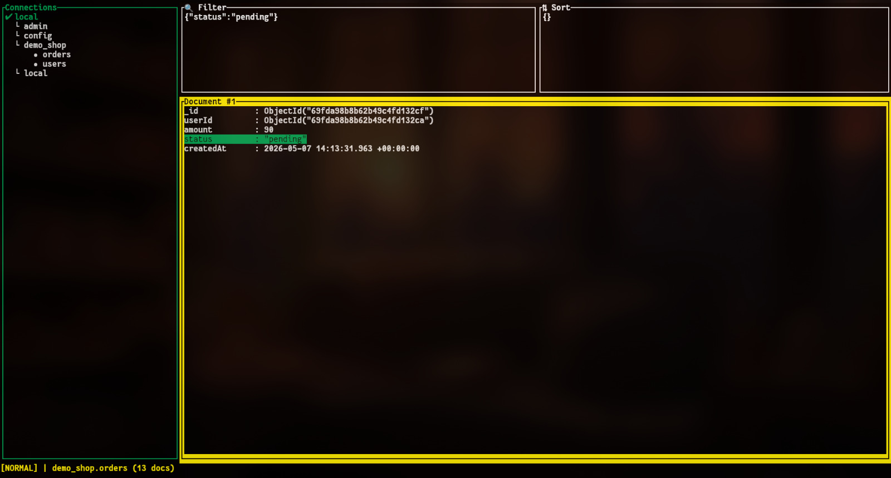

# MongoDB TUI 

A terminal-based TUI application for browsing and managing your MongoDB collections and databases. It supports JSON import/export, document editing, collection management, and script execution.



## Prerequisities

Before installaion make sure following tools are installed : 

### MongoDB

#### Arch Linux (or Arch-based distros)
```sh
yay mongodb-bin
yay mongodb-tools-bin #for import export
```
```sh
sudo systemctl start mongodb
```
```sh
sudo systemctl enable mongodb
```
#### Other Distros
For installation instructions, see:
https://www.mongodb.com/docs/manual/installation/
#### Rust
```sh
curl --proto '=https' --tlsv1.2 -sSf https://sh.rustup.rs | sh
```
After installation, either restart your terminal or run:
```sh
source $HOME/.cargo/env
```
Then confirm installation with:
```sh
rustc --version
cargo --version
```

### Install
#### Arch Linux (or Arch-based distros)
```sh
yay mongodbtui
mongodbtui
```

#### Build from Source
```sh
git clone git@github.com:vehbican/mongodbtui.git
cd mongodbtui
chmod +x install.sh
./install.sh
mongodbtui
```
## Keybindings

### Global
| Key        | Action                                |
|------------|----------------------------------------|
| `?`        | Toggle help popup                      |
| `Ctrl+p`   | Open command palette (normal mode)     |
| `t`        | Cycle theme (system, emerald, ocean, rose, monochrome) |
| `y` / `n`  | Confirm / cancel a pending action      |
| `q`        | Quit the application                   |
| `Esc`      | Dismiss popup / clear search hits      |

### Command Palette

Press `Ctrl+p` in normal mode to search available commands. Type words such as
`exp col`, `theme ocean`, or `filter`; matching is case-insensitive and supports
multiple search words. Use `↑` / `↓` to select, `Enter` to run, and `Esc` or
`Ctrl+p` to close. `Backspace` edits the search; terminal paste is supported.

The palette includes connection and collection actions, document editing and
deletion, bulk operations, import/export, filter/sort editing and reset, theme
selection, panel focus, help, and quit. Contextual commands appear when the
required connection, database, collection, or document is selected. Tree actions
use the selected tree item; document/query actions use the loaded collection.
Deletion commands open the existing confirmation prompt.

Close input editors, file pickers, or pending confirmations before opening the palette.

### Focus Navigation
| Key            | Action                           |
|----------------|----------------------------------|
| `Ctrl+l`       | Focus → Documents                |
| `Ctrl+h`       | Focus → Connections              |

### List Navigation
| Key         | Action                                 |
|-------------|----------------------------------------|
| `j` / `↓`   | Move down                              |
| `k` / `↑`   | Move up                                |
| `Enter`     | Connect / expand database / load collection |

### Connections & Collections
| Key     | Action                                                                 |
|---------|------------------------------------------------------------------------|
| `o`     | Add new MongoDB connection                                             |
| `/`     | Search collections                                                     |
| `n` / `N` | Next / previous collection search match                              |
| `e`     | Edit selected connection or collection name                            |
| `x`     | Export selected collection or database                                 |
| `i`     | Import collection into selected database                               |
| `I`     | Import database into selected connection                               |
| `f`     | Run shell script from file picker                                      |
| `d` + `d` | Request deletion of selected collection or database                 |

### Documents
| Key       | Action                               |
|-----------|--------------------------------------|
| `/`       | Edit filter command                  |
| `s`       | Edit sort command                    |
| `Ctrl+d` / `PageDown` | Scroll document down        |
| `Ctrl+u` / `PageUp` | Scroll document up            |
| `Enter`   | Expand/collapse selected field       |
| `n` / `N` | Next / previous field in selected document |
| `e`       | Edit selected document in external editor |
| `U`       | Edit a bulk update for filtered documents in `$EDITOR` |
| `X`       | Request deletion of filtered documents |
| `y`       | Copy selected field as filter fragment |
| `d` + `d` | Request deletion of selected document  |
| `D`       | Request deletion of selected field (except `_id`) |

### Insert Mode
| Key         | Action               |
|-------------|----------------------|
| `Enter`     | Submit input / apply filter or sort |
| `Esc`       | Cancel editing       |
| `← / →`     | Move cursor (`→` accepts a visible filter/sort suggestion) |
| `Backspace` | Delete character     |
| `Ctrl+V`    | Paste clipboard      |
| `Ctrl+Shift+V` | Paste from terminal |

### File Picker (Import / Export / Script)
| Key       | Action                          |
|-----------|---------------------------------|
| `j / k`   | Navigate entries                |
| `Space`   | Select/Deselect file            |
| `Enter`   | Enter directory                 |
| `c`       | Confirm action (import/run)     |
| `Esc`     | Exit file picker                |

### Filter and Sort History

Submitted filter and sort commands are saved separately across sessions. While editing
with `/` or `s`, the most recently used command matching your input appears as a muted
inline suggestion. Press `→` to fill it in, then `Enter` to apply it.
Suggestions work at the end of the input and just before the closing `}` in the
default `{}` template. `←` moves the cursor as usual.

Each history keeps up to 500 unique commands, with reused commands moved to the
most recent position. Empty commands and `{}` are skipped; `Esc` does not save an entry.

## Config Paths

- The `connections.csv` file is used to store your saved MongoDB connections and is located at:  
  `~/.config/mongodbtui/connections.csv`

- Filter and sort history is stored in `history.json` in the app's config directory
  (on Linux: `${XDG_CONFIG_HOME:-~/.config}/mongodbtui/history.json`).

- All exported collections and databases (as .json files and folders) are saved under:  
  `~/.local/share/mongodbtui/`
